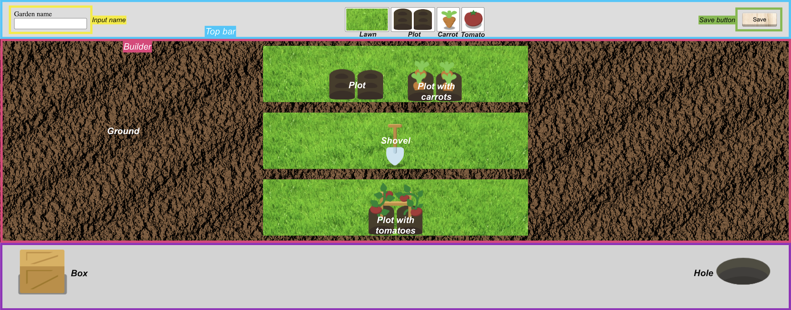
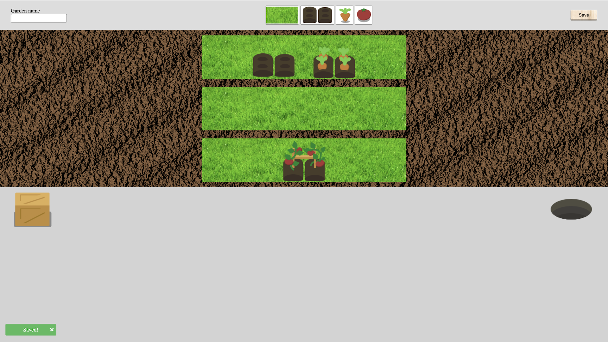
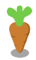
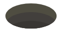
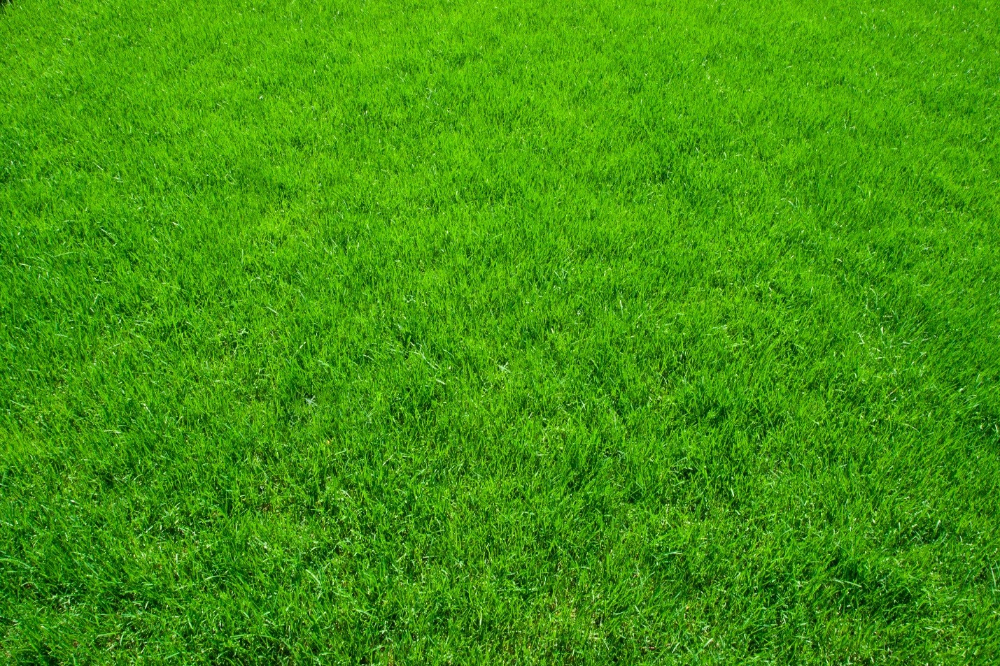
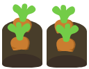
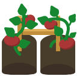

# Introduction

This readme will help you to set up your environment and it explains the code challenge objectives and specifications.

Don't forget that your goal is to demonstrate your technical skills!

# Set up your environement

## Get Node 18

Please install node 18 on your environment to run our code challenge. You can find the package here: https://nodejs.org/en/download/ and you can follow the instructions here: https://nodejs.org/en/download/package-manager/

## Get Docker

Please install Docker to be able to run our code challenge. Follow the instructions here: https://docs.docker.com/get-docker/

## Run Docker container

Once you have Docker installed, you can :
* copy the `.env.dist` file, paste it and rename it `.env`
* run from the project directory

```
make docker-build
```

It will run several steps and build a container into your newly intalled Docker named `passport-code-challenge`.

Make sure that front, back and database docker images are running on Docker app (if not, you can run them by clicking on the start button).

Now you can go to the browser of your choice and go to http://localhost:3000/. The challenge will be displayed, and it's time to develop!
Any change to the code will be automatically applied on your localhost.

If you encounter an issue with an image, you can try to stop and start the Docker images or clean the container (see next section) and rebuild it.

**Important**: the `db/init.sql` file is executed only if the database image is empty, so when you want to test a change, delete the Docker container and run `make docker-build` again.

Note:
* front-end is running on port 3000
* back-end is running on port 8000

## Start Docker container without rebuild

If you need to restart the containers, just run
```
make docker-start
```

## Clear Docker container

If you need to clear the code challenge container, just run

```
make docker-clean
```

# Get started with the code challenge



If needed, you will find a glossary at the end of this document.

## Objectives and specifications

### Objectives

There are three objectives to this challenge:
* implement a drag-and-drop tool to create a vegetable garden
* create an API to be able to save this vegetable garden
* create a Toast component (on your own) to indicate that the save was successful

Each task will allow you to work on different subjects. Respectively:
* organize data into store(s) with drag-and-drop operations, optimize renders
* design and develop a small API in Golang, with some validations
* React and UI best practices

Below you will find specific rules for the tool, some code to start within the `front` folder, and assets in `front/src/assets`. The `back` and `db` folders contain a simple example of a back-end router and an SQL request on a dummy table.
Fill the file `db/init.sql` with the SQL instructions needed for your solution.

### Specifications

The nesting order is: Carrot or Tomato **IN** Plot **IN** Lawn **IN** Ground. You should not be able to drop elements differently (like, it is not possible to drop a carrot directly in a lawn, you need a plot).

Except if you are coding the box or hole bonus (see the Bonus section), you should not be able to drag an element from the builder to the builder, only from the top bar to the builder.

You can add a lawn onto the ground. Maximum 5 lawns can be added to the ground. Drag-and-drop rules:
* When dragging a new lawn over a full ground (with already 5 lawns), nothing happens.
* Hovering an empty ground while dragging a lawn will display a shovel at the top of the builder. Dropping the lawn there will add a new lawn to the ground.
* Hovering a non-empty ground with a lawn in hand will result in 2 different behaviors depending on the position of the mouse on the existing lawns. If the mouse is on the upper half of an existing lawn, a shovel will be displayed **above** the existing lawn, and dropping it will add a new empty lawn above the existing lawn. If the mouse is on the lower half of the existing lawn, a shovel will be displayed **below** the existing lawn and the new empty lawn will be added below the existing one.

Take a look at `./codeChallengeVideos/draggableLawn.mp4` video as an example.

You can add a plot on a lawn. Maximum 2 plots can be added per lawn (one left, one right). Drag-and-drop rules:
* When dragging a plot, nothing happens for lawns that already have 2 plots.
* Hovering a lawn while dragging a plot over the left half of the lanw will display a shovel on the left half. 
* Hovering a lawn while dragging a plot over the right half of the lanw will display a shovel on the right half. 
* Dropping the plot will add it where the shovel was displayed.

Take a look at `./codeChallengeVideos/draggablePlot.mp4` video as an example.

You can add a carrot or a tomato on an empty plot. Drag-and-drop rules:
* When dragging a carrot or a tomato on a plot that is not empty, nothing happens.
* Hovering an empty plot while dragging a carrot or a tomato will display a shovel **above** the plot, and dropping a carrot or tomato will change the plot to a plot with carrots or a plot with tomatoes.

Take a look at `./codeChallengeVideos/draggableCarrot.mp4` and `./codeChallengeVideos/draggableTomato.mp4` videos as examples.

You should be able to enter a name for your vegetable garden in the input in the top bar. The name should start by `garden_` and should not be longer than 255 characters. Please make sure you created all the needed validations.

If you refresh the page, you will return to the saved vegetable garden.

Clicking on the save button will save the vegetable garden and its name. When the button is clicked, a Toast component is displayed on the bottom left corner of the screen. The Toast component is closable by clicking on it, and maximum 3 instances of this component can be displayed on the screen at once. A Toast component disappears automatically after 10 seconds. Keep its design simple.
Note: Please don't use any library for Toast component, we want to see how you'll manage components creation by yourself (like for a design system)



If the save operation fails, because of the validation, for example, display an error in a Toast component.


### Bonus challenges

These are bonus challenges, it means that you can do it to show everything you are capable of but it's not mandatory. You can decide to pick any item you like, there is no order.

* Validate that there is at least one plot in each lawn on the saved vegetable garden.

* You can remove a plot or a lawn by dragging it into the hole. For plots, they will be deleted from the lawn. For lawns, the entire lawn and its content (the plots inside it) will be deleted.

* Create a front-end router to manage several vegetable gardens by adding an ID in the URL. When loading the page, if the ID is found in the database, it will load the saved garden, otherwise an empty garden will be created.

* You can harvest plots with carrots and tomatoes dragging them into the box. It will replace the dragged plot by an empty plot and display a Toast announcing what has been harvested ("Tomatoes" or "Carrots").

* When dragging an element from the builder (not from the top bar), hide it from the view until the drop operation is triggered. Example: I am clicking on a plot with carrots to drag it from its lawn to the box. While I am dragging it, the plot with carrots will no longer be displayed in the builder.

* Make sure there is no useless render.

* Add unit tests on the Toast component.

* Manage versioning of your saved vegetable gardens: keep the last 3 versions and create a route to come back to an oldest version.

## Glossary

* Box : (bonus) the element that you can use to harvest plots with carrots and plots with tomatoes.

* Builder: the part of the screen where you can create your vegetable garden and drop elements. See the screenshot at the top of this section.

* Carrot : a draggable element from the top bar represented by a carrot image that you can drop on an empty plot.

* Element: any item that you can interact with (drag and/or drop).

* Ground : the brown portion of the builder. Lawns can be added on it, maximum 5.

* Hole : (bonus) an element represented by an image of a hole that you can use to remove an element from your vegetable garden.

* Lawn : a draggable element from the top bar represented by grass that you can drop on the ground and where plots can be added (2 maximum).

* Plot : a draggable element represented by an image of a plot that you can add in a lawn, maximum 2 per lawn. When you drop carrots or tomatoes on an empty plot, it becomes a plot with carrots or a plot with tomatoes.

* Plot with carrots : the final state of the plot when you dropped a carrot on an empty plot.

* Plot with tomatoes : the final state of the plot when you dropped a tomato on an empty plot.

* Shovel : a placeholder displayed on the builder that indicates where you will drop an element.

* Toast: a component rendered at the bottom left of the screen to display information to the user. In our test, it is used to show that the vegetable garden was saved correctly. Maximum 3 Toast components should be displayed at once.

* Tomato : a draggable element from the top bar represented by a tomato image that you can drop on the plot.

* Top bar: the top part of the screen, where you can enter a name for your vegetable garden, find new elements to drag inside, and save it. See the screenshot at the top of this section.

* Vegetable garden: this is the goal of the challenge, be able to create a vegetable garden in the ground, with lawns, plots, carrots and tomatoes.
